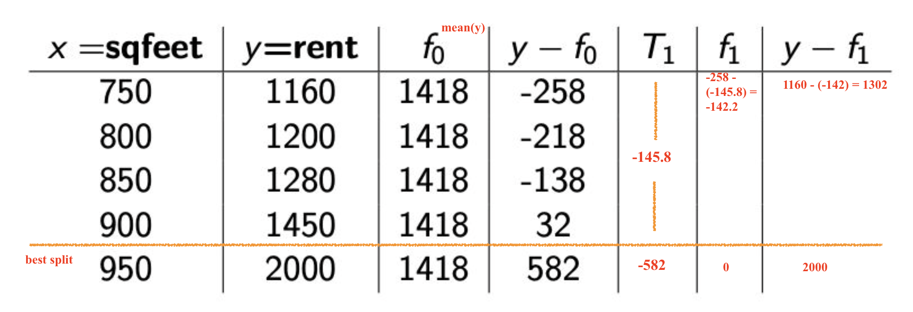
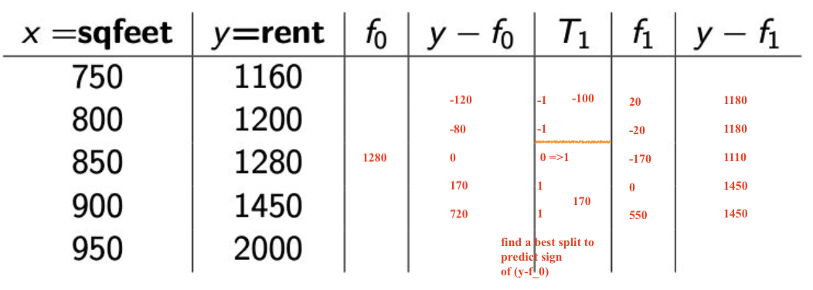

# Introduction

* Trends in ML: 

  * Deep Learning
    * text generation
    * Translation
    * Picture/music recognition

  * Natural Language Processing

    * BERT
    * unsupervised pretrainnng:
      * training models on tasks generated by natural text
      * with it can traning models with fewer labelled examples.
    * When using, need to easily finetune a little

  * > What is Transfer Learning?

    > Improvement of learning on a new task by trasfering the knowledge from a related task that have already been learned

    * recycling
    * good for image and NLP

  * Appiled ML:

    * Deep nerual nets:
      * convolutional nets for image
      * RNNs, BERT/Transformer for NLP
    * ensembled model add 2-5% in performance, but also rather comlex and not worth it in practice.

* ML in industry
  * feature engineering
  
  * recommender system
  
  * ***Models, but not just building mdels - selecting and framing a problem***
    
    * *start with a business problem*
    
      * *establish a baseline*
      * *check your assumption*
      * *Select model/learning technique*
      * *Select feature*
      * *Measure/evaluate, experiment*
      * *stability scalability robustness*
    
    * *break down the problem*
    
    * *understand the impact*
    
    * *Find the right data*
    
    * *select an objective function*
    
    * *build models*
    
    * *measure and evaluate*
    
      * *definiting the right metrics*
      * *offline evaluation*
      * *A/B testing*
      * *meaningful v.s. representative*
      * *representativeness and stability of results*
      * *offline v.s. online metrics*
    
    * *experiment*
    
      * *how to split trafic*
      * *how long to run*
      * *calibration*
      * *model interactions*
      * *residue effect from previous experiments*
    
    * *Productionalize/scale*
    
      * *plan for valuavle failure*
      * *measure long term/steady state effects*
      * *Engineering improvements - reuse old things*
      * *durability an robustness*
      * *measurment, monitoring, experimentation*
    
      

# Part 1

### Recommendation system overview

* > What is recommender system?

  > Application that provided to users personalized recommendations about content that they may be interested in.

* Type
  * > Content-based: analysis of the attributes of items and use simliarity between items to recommend items similar to what a user likes
  
    * creat content features for every items, but creating features is not easy
  
  * > Collaborative filtering about neighbors: use similarity between users and items simultaneously to provide recommendations, based on past user behavior (ratings, transactions)
    
    * similarities + former user behavior
    
    * need extra data - feedbacks
    
      > explicit feedback: ratings by users
      >
      > implicit feedback: infer user preference by monitering user actions like purchase, clicks
  
* elements
  * user item, context(device/location/time), interface(phone/PC..)
  
  * User, item, utility matrix(sparse)
  
    * > utility matrix: degree of preference that a user has for an item, sparse(~1%)
  
  * Architecture

#### Collabrative filtering

* memory based methods - KNN
  
  * > memory based methods: memorize the utility matrix, a type of KNN, tend to be slow
  
  * > KNN: computer distance between points, find the k nearest neighbors and vote/average
  
  * to predict whether alice is gonna like Joker
  
    * user based: find user similar to Alice and watched and rated joker
  
    * item based: find item similar to Joker that Alice wached and rated
  
    * > find movies that Alice rated that are similar to 'Joker', predict average rating on these movies for Alice's possile rating on 'Joker
  
  * measure: 
  
    * Pearson correlation
    * Cosine similarity
    * Jaccard similarity
  
* model based methods - Matrix Factorization

  * > model based methods: fit a model, tend to have better performance


# Part 2

### Matrix factorization

* > Matrix Factorization Loss function:
  > $$
  > \frac{1}{N} \sum_{(i,j): r_{ij}=1} (y_{ij}-u_iv_j)^2
  > $$

* Gradient descent of MF

  > $$
  > Loss = E(U,V) = \frac{1}{N}\sum_{(i,j):r_{i,j}=1} (y_{ij}-u_iv_j)^2 \\
  > 
  > \frac{\partial L}{\partial u_{ik}} = -\frac{2}{N} \sum_{j:r_{i,j}=1} (y_{ij}-u_iv_j) v_{jk} \\
  > 
  > \frac{\partial L}{\partial v_{jk}} = -\frac{2}{N} \sum_{i:r_{i,j}=1} (y_{ij}-u_iv_j) u_{ik} \\
  > 
  > u_{ik} \leftarrow u_{ik} + \frac{2\eta}{N} \sum_{j:r_{i,j}=1} (y_{ij}-u_iv_j) v_{jk} \\
  > 
  > v_{jk} \leftarrow v_{jk} + \frac{2\eta}{N} \sum_{i:r_{i,j}=1} (y_{ij}-u_iv_j) u_{ik}
  > $$
  >
  > Vectorized
  > $$
  > \Delta = (Y - U\cdot V^T)\\
  > 
  > \frac{\partial E}{\partial U} = -\frac{2}{N} \Delta \cdot V\\
  > 
  > \frac{\partial E}{\partial V} = -\frac{2}{N} \Delta^T \cdot U
  > $$
  > 

* Gradient descent with momentum

  > $$
  > w \leftarrow random \ inital \\
  > v \leftarrow 0 \\
  > β= 0.9 \\
  > \\
  > 
  > v_t \leftarrow \beta v_{t-1} + (1-\beta) \triangledown E(w_t) \\
  > w_{t+1} \leftarrow w_t - \eta v_t\\
  > $$
  > 

  

* Regularization, avoid overfitting, how to pick lambda

  > $$
  > \frac{1}{N}\sum_{(i,j):r_{ij}=1}(y_{ij}-u_iv_j)^2 + \lambda(\sum_{i=1}^{n_u}\sum_{k=1}^{K} u_{ik}^2 + \sum_{i=1}^{n_m}\sum_{k=1}^{K} v_{ik}^2)\\
  > 
  > \text{where,} N =\sum_{ij}r_{ij}
  > $$

#### SIDE TOPIC: Feedback

- Feedback

  - explicit: Ask for rating - movies, online stores

    - User are unwilling to provide responses

    - > explicit feedback:  biased by only from people who willing to provide ratings

  - implicit: infer user preference

    - purchase history, browsing history, search patterns

    - Pros: easy to get

    - Cons:

      - No nagative feedback, positive-only data: only know user listen to which song, but don't know which song user hate

        - > Missing as negative: fill empty with zeros 
          >
          > * matrix is fully defined no need $(i,j): r_{ij}=1$, but can be expensice
          >
          > * may want to weight 0s less than 1s: weak negatives
          >
          > Negative sampling: sample empty spaces to get zeros
          >
          > * uniform random sampling
          > * user-oriented sampling: if a user has viewed more items, then those he/she hasn'e viewed can be sampled as negative with higher probability
          > * Item-orinted sampling: a more popular item has higher probability to be sampled as negative

      - No level of preference: how much time spent or how many times


### Content based Recommendations

* > Content based recommendation?
  >
  > Analysis of the attributes of the items, build user profiles based on the content features of the items rated by users, recommend new item based on items features and user profile
  >
  > Collaborative filtering: can be only based on user/item(KNN based), or both(MF)

- Ingredients for content based recommendation:
  - item representation: based on content
  - user representsation: based on item user liked
  - similarity metric/ machine learning model
  - ratings

#### Item profile and item-based User profile

- item profile

  - music item profile: 

    - audio content analysis
      - Features: beat..
      - high level descriptors from low-level features via Deep learning: genre, semantic
    -  text analysis: lyric, user generated context/review

  - movies item profile: actors, director, year, genre, publisher, location, image, audio

  - Document item profile: 

    - > TF-IDF: 
      > $$
      > tf(t,d) = \frac{count(t)}{|d|}\\
      > \\
      > \begin{align*}
      > df(t,N) &= \frac{|\{d_i:t \in d_i,i = 1,...,N\}|}{N}\\
      >  & \approx \frac{|\{d_i:t \in d_i,i = 1,...,N \}|+ 1}{N + 1}
      > \end{align*}
      > \\
      > \text{this is to avoid zero in side log in tfidf function}
      > $$
      >
      > $$
      > \begin{align*}
      > tfidf(t,d,N) &= \frac{tf(t,d)}{df(t,N)}\\
      >  & \approx  tf(t,d) \times log(\frac{1}{df(t,N)})
      > \end{align*}
      > $$

      - remove stopwords, compute scores, keep N words with high score as a vector for presentation 

    - Word embeddings/ sentence embedding

    - Topic modeling: the probability of a document in a topic

- User profile based on items: "user likes actor A,  director B, genre C..."

  - domographics
  - declared interests: select when creating a account
  - location/IP
  - usage features: last time visit, frequency
  - search history
  - item set: user showed interest, click, shared, liked

#### SIDE TOPIC: similarity measurement

> meansure of how similar, used in KNN

- Jaccard similarity
  $$
  \frac{|A \cap B | \leftarrow \text{intersection}}{|A\cup B| \leftarrow \text{union- - - - -}}
  $$

  * > when to use Jaccard similarity?
    >
    > * measure similarity between two sets
    >
    > * binary features, will lose information if used in non-binary features
    >   * <span style="color:#D0505D">*how to take binary features to sets?*</span> *=> general cases*
    >   * <span style = 'color:#d0505d'>*how to go from x,y to A,B?*</span> 
    > * model lack of ratings, since it only count numbers

- Cosine similarity
  $$
  \begin{align*}
  sim(x,y) = cos(\theta) &= \frac{x\cdot y}{|x|\times|y|} \\
  & = \frac{\sum_{i=1}^n x_iy_i}{\sqrt{\sum_{i=1}^{n}x_i^2}{\sqrt{\sum_{i=1}^{n}y_i^2}}}
  \end{align*}
  $$

  * > when to use cosine similarity?
    >
    > * often used in similarity between documents
    > * lack of rating is treated as 0, more similar to disliking than liking
    > * of used in positve space, $x_i, y_i \ge 0$

- Pearson coorelation coefficient
  $$
  r(x,y) = \frac{\sum_{i=1}^n (x_i - \bar{x})(y_i-\bar{y})}{\sqrt{\sum_{i=1}^{n}(x_i - \bar{x})^2}{\sqrt{\sum_{i=1}^{n}(y_i - \bar{y})^2}}}
  $$

  * > when to use pearson coorelation?
    >
    > Measure of linear correaltion between two variables
    >
    > 1 is total positive correlation, 0 is no correlation, -1 is total negative correlation

### Memory based and Model based methods

* First always, compute profile vectors for users and items

#### Memory based

> K-Nearest Neighbor(KNN)
>
> * steps:
>   * pick similarity measurement and compute similarity between users and items
>   * Recommend to user items with high similarity form maybe item or other user
>
> * Scale:
>   * When too many user and items, it is too expensive to compute similarity
>     * <span style="color:#D0505D">*locality-sensitive-hashing can be used to place item profiles in buckets?*</span>
>     * <span style="color:#D0505D">given a user, easy to find buckets with high similarity to user?</span>

#### Model based

> Matrix Factorization(MF)
>
> * Train a model using the feature vectors
>   * actually likes, ratings, clicks
>   * regression to predicted ratings, classification to predict prob of click
>   * can include features that are not content based


# Part 3 Summary of recomendation system

- Summary of recommendation systems so far

  - two type
    - Content based systems: features are based on content
    - Collaborative filtering systems: behavioral data about users (rating, buying, watching) items
      - KNN (memory based)
      - Matrix factorization (model based)
      - Data: utility matrix based on explicit or implicit feedback

- >  How to make recommendations?
  >
  > - Option 1: predict rating all unseen and recommend high ratings - expensive
  > - Option 2: similay item to what she saw recently
  >   - <span style="color:#D0505D">embedding item at the very beginning as a fast approximate KNN</span>

- Pros/Cons of content base recommendation

  > - Pros 
  >   - no need for more datas on other users
  >   - no cold-start problem on new item
  >   - easy to explain: just content, and by checking the features
  > - Cons:
  >   - domain knowledge for feature vectors
  >   - new genre is hard to recognize, which is actully a unseen item feature ever
  >   - Some kind of items are not amenable to easy feature extraction (movies, music)
  >   - quality: this book are too basic, though content is ok

### SIDE TOPIC: Cold start problem

- new user with no implicite or explicite feedback
  - popular thing
  - ask for more info - tag yourself
  - social network assumption: people have similar tastes to their friends
- new item with no rating
  - content feature


# Part 4 Pytorch

### general pytorch

* **transfer data to tensor**

  * ```python
    x = torch.tensor([[1.,2.],[3.,4.]])
    x.shape #2,2
    
    x = torch.randn(5,10).type(torch.FloatTensor)
    x.shape #5,10
    x.view(1,-1).shape # 1,50
    ```

  * unsqueese(1)

    ```
    x.unsqueeze(2)
    x.shape #5,10,1
    ```

* **autograd flag**

  * ```python
    # a signal telling pytorch it is going to do gradient descent on this variable
    x = torch.tensor([1.,2.,3.,4.,5.,6.], requires_grad=True)
    x = torch.tensor([1.,2.,3.,4.,5.,6.]).requires_grad_()
    ```

  * How it works

    ```python
    L = (2*x**2 + 1).mean()
    L.backward()
    x.grad #tensor([0.6667, 1.3333, 2.0000, 2.6667, 3.3333, 4.0000]
    ```

  * How to remove it? This is useful at validation time

    ```python
    torch.no_grad()
    # Prevent the gradients from being calculated in a piece of code. This is useful at validation time
    ```

* **Detach to numpy**

  ```python
  x.detach().numpy()
  ```

### Create Model

`nn.Linear(5, 3)` creates a linear transformation with parameters $A$ and $b$ ($A\cdot X+b$). Given an input matrix of observations $X$ ($N \times 5$), `nn.Linear(5, 3)` transforms X into a $N \times 3$ matrix, where $N$ can be anything (number of observations).

```python
def lin(a,x,b): return a*x+b

def gen_fake_data(n,a,b):
  x = np.random.uniform(0,1,n)
  y = lin(a,x,b) + 0.1* np.random.normal(0,3,n)
  return x,y

x,y = gen_fake_data(50,3,8)

def mse(y_hat, y):
  return np.mean((y-y_hat)**2)

def mse_loss(a, b, x, y): 
  return mse(lin(a,b,x), y)
```

* **Model in pytorch**

  ```python
  model = torch.nn.Sequential(
  	nn.Linear(1,1)
  )
  model
  ```

  * write it in a class

  ```python
  class LinearRegression(nn.Module):
  		def __init__(self):
      		super(LinearRegression, self).__init__()
          self.lin = nn.Linear(1,1)
          
      def forward(self, x): ## create a model by calling LinearRegression()   
        	x = self.lin(x)
          return x
        
  model = LinearRegression()  
  model(x.float())
  ```

  * data dimension opeartion

  ```python
  x, y = gen_fake_data(10000, 3., 8.)
  x = torch.tensor(x).float()
  y = torch.tensor(y).float()
  x.shape #10000
  
  x_2 = torch.unsqueeze(x, 1)
  x_2.shape # 10000,1
  
  x_3 = torch.squeeze(x, 1)
  x_3.shape # 10000
  ```

* **Optimizer**

  * ```python
    learning_rate = 0.1
    optimizer = torch.optim.Adam(model.parameters(), lr=learning_rate)
    ```

### A general process

* elements:

  * ```model.train()```
  * Calculate `y_hat = model(x)`
  * specify `loss = F.mse_loss(y_hat, y)`
  * `optimizer.zero_grad()`
  * `loss.backward()`
  * `optimizer.step()`
  * `model.eval()`, this is for validation

  ```python
  for t in range(1000):
    	model.train() 							# turn on training mode
      y_hat = model(x.float()) 						# apply model on x to compute y_hat
      loss = F.mse_loss(y_hat, y) # calculate loss
      # loss = F.binary_cross_entropy_with_logits(y_hat, y)
      
      optimizer.zero_grad()				# set optimizer's variables's grad to be 0
      loss.backward()							# compute gradient
      # Computes the gradient of loss with respect to all Variables with requires_grad=True.
      # After this call a.grad and b.grad will be Variables holding the gradient
      # of the loss with respect to a and b respectively
      
      optimizer.step()						# update optimizer's parameters
      
      model.eval()								# turn on evaluate mode
      y_hat_val = model(x_val)
      val_loss = F.mse_loss(y_hat_val, y_val)
      # val_loss = F.binary_cross_entropy(torch.sigmoid(y_hat_val), y_val)
      print(loss.item(), val_loss.item())
  ```

### Integrate Data

```python
from torch.utils.data import Dataset, DataLoader
```

* generate dataset

  ```python
  def lin(a,b,x): return a*x+b
  
  def gen_fake_data(n, a, b):
      x = np.random.uniform(0,1,n) 
      y = lin(a,b,x) + 0.1 * np.random.normal(0,3,n)
      return x.astype(np.float32), y.astype(np.float32)
  
  # create a dataset
  class RegressionDataset(Dataset):
      def __init__(self, a=3, b=8, n=10000):
          x, y = gen_fake_data(n, a, b)
          x = torch.from_numpy(x).unsqueeze(1)
          y = torch.from_numpy(y)
          self.x, self.y = x, y
      
      def __len__(self):
          return len(self.y)
      
      def __getitem__(self, idx):
          return self.x[idx], self.y[idx]
      
  fake_train_ds = RegressionDataset()
  fake_valid_ds = RegressionDataset()
  ```

* Data loader

  ```python
  train_dl = DataLoader(fake_train_ds, batch_size=1000, shuffle=True)
  valid_dl = DataLoader(fake_valid_ds, batch_size=1000, shuffle=False)
  
  x, y = next(iter(train_dl)) # next batch
  ```

  * what is data loader used for?
    * Batching data
      * Why? data is bigger than memory; gradient noise since small set not whole
      * for each batches, the surface of bowl changes and the minimum is not a single point, it changes in each batch but in this case is more generalizable
    * Shuffling data: so won't all 1 or 0
      * no need to shuffle validation data since it is not used for training
    * Load the data in parallel using multiprocessing workers.

* loss

  ```python
  from sklearn.metrics import r2_score
  
  def val_metric(model, valid_dl):
      model.eval()
      losses = []
      y_hats = []
      ys = []
      for x, y in valid_dl:
          y = y.unsqueeze(1)
          y_hat = model(x.float()) #x.float()
          loss = F.mse_loss(y_hat, y.float())
          y_hats.append(y_hat.detach().numpy	()) # y.detach().numpy()
          ys.append(y.numpy()) 
          losses.append(loss.item()) # .item()
      
      ys = np.concatenate(ys) # extend
      y_hats = np.concatenate(y_hats)
      return np.mean(losses), r2_score(ys, y_hats)
    
  # be carefull when log loss = 0.69
  ```

* train

  ```python
  ## train_loop function
  def train_loop(model, train_dl, valid_dl, optimizer, epochs):
      for i in range(epochs):
        	losses = []
          model.train() # be careful where the model.train() is
          for x, y in train_dl:
              y = y.unsqueeze(1)
              y_hat = model(x.float())
              loss = F.mse_loss(y_hat, y.float())
              optimizer.zero_grad()
              loss.backward()
              optimizer.step()
              losses.append(loss.item())
          
          train_loss = np.mean(losses)
          valid_loss, valid_auc = val_metric(model, valid_dl)
          print("train loss %.3f valid loss %.3f auc roc %.3f" % (train_loss, valid_loss, valid_auc))
  ```


* Matrix factorization with PyTorch

  * Encoding data: remove validation data which not in training data

    ```python
    userid2idx = {o:i for i,o in enumerate(train_user_ids)}
    
    train["userId"] = train["userId"].apply(lambda x: userid2idx[x])
    val["userId"] = val["userId"].apply(lambda x: userid2idx.get(x, -1)) 
    # -1 for users not in training
    ```

  * Embedding layer

    * encode user and items into vectors

      ```python
      embed = nn.Embedding(10, 3)
      embed.weight # now is random
      ```

    * 'lookup' exactly from embed.weight with index

      ```python
      a = torch.LongTensor([[1,0,1,4,5,1]]) #[1,0,...] these are index inside embed.weight
      embed(a)
      ```

    * ```python
      class MF(nn.Module):
          def __init__(self, num_users, num_items, emb_size=100):
              super(MF, self).__init__()
              self.user_emb = nn.Embedding(num_users, emb_size)
              self.item_emb = nn.Embedding(num_items, emb_size)
              
              self.user_emb.weight.data.uniform_(0,0.05)
              self.item_emb.weight.data.uniform_(0,0.05) # initlializing weights
              
          def forward(self, u, v): # MF(x) called this method
              u = self.user_emb(u) # find the embedded value for user
              v = self.item_emb(v)
              return (u*v).sum(1) 
            	# element wise multiplication
           	 	# sum(1), 1 is the axis = 1
      ```

  * Training MF model

    ```python
    # not using data loaders because our data fits well in memory
    def train_epocs(model, epochs=10, lr=0.01, wd=0.0):
        optimizer = torch.optim.Adam(model.parameters(), lr=lr, weight_decay=wd) 
        # wd => L2 regularization \lambda in the loss function
        # in the gradient it is (dL/du + 2·lambda·u)
        for i in range(epochs):
            model.train()
            
            # get user index and item index
            users = torch.LongTensor(train.userId.values)  #.cuda()
            items = torch.LongTensor(train.movieId.values) #.cuda()
            
            ratings = torch.FloatTensor(train.rating.values)  #.cuda()
        		
            # put index into model and get embedding
            y_hat = model(users, items)
            
            loss = F.mse_loss(y_hat, ratings)
            optimizer.zero_grad()
            loss.backward()
            optimizer.step()
            testloss = valid_loss(model)
            print("train loss %.3f valid loss %.3f" % (loss.item(), testloss)) 
    ```
  
    ```python
    def valid_loss(model):
        model.eval()
        users = torch.LongTensor(val.userId.values) 
        items = torch.LongTensor(val.movieId.values) 
        ratings = torch.FloatTensor(val.rating.values) 
        y_hat = model(users, items)
        loss = F.mse_loss(y_hat, ratings)
        abs_loss = F.L1_loss(y_hat, ratings)
        return loss.item(), abs_loss.item()
    ```
  
  * MF with bias
  
    ```python
    class MF_bias(nn.Module):
        def __init__(self, num_users, num_items, emb_size=100):
            super(MF_bias, self).__init__()
            self.user_emb = nn.Embedding(num_users, emb_size)
            self.user_bias = nn.Embedding(num_users, 1) # bias term
            self.item_emb = nn.Embedding(num_items, emb_size)
            self.item_bias = nn.Embedding(num_items, 1)
            # init 
            self.user_emb.weight.data.uniform_(0,0.05)
            self.item_emb.weight.data.uniform_(0,0.05)
            self.user_bias.weight.data.uniform_(-0.01,0.01)
            self.item_bias.weight.data.uniform_(-0.01,0.01)
            
        def forward(self, u, v):
            U = self.user_emb(u)
            V = self.item_emb(v)
            b_u = self.user_bias(u).squeeze()
            b_v = self.item_bias(v).squeeze()
            return (U*V).sum(1) +  b_u  + b_v
    ```
  
  * Lab
  
    * Can we change the first model to predict numbers in a particular range? Hint: sigmoid would create numbers between 0 and 1. Would this improve the model? `4*sigmoid(x)+1 => [1,5]` **since it the rating thing**=> working on the loss and then changes everything
    * Would a different Loss function improve results? What about absolute value instead of F.mse_loss? `l1_loss`


# Part 5 Adaboost

* Review of decision trees: popular, building block, interpretable

  * bushy: Overfitting, high variance(sensitive to small changes in data), low bias(good on traning data)

  * shallow: underfitting, hight bias

  * Measure of impurity： impurity is a way to define best

  * Tree notation:
    $$
    T(x;\theta) = \sum_{j=1}^{J}\beta_j \mathbb{1}_{[x \in R_j]}\\
    T(x; \theta) = \frac{1}{\# items}
    $$

* Boosting question 

  * Binary stump trees example,  $\hat{y} \in \{-1,1\}$
    $$
    T(x) = \mathbb{1}_{[x\in \{wind=false\}]} - \mathbb{1}_{[x\in \{wind=true\}]}
    $$

    * error rate is the overall error rate of the stump tree

  * weak classifiers

    * pros: fast, no-overfit
    * Cons: underfit, low accuracy
    * *how to make it better: more features, ensamble(random forest), boosting*

* Ensemble models

  * where $\alpha's$ are weights based on error rate from each binary stump, misclassified data has larger weight so it well be 'taken care' well in next tree

  $$
  G(x) = sign(\alpha_1G_1(x) + \alpha_2G_2(x)  + \alpha_3G_3(x) +...)
  $$

  * *difference between RandomForest and Adamboost?*
    * *Initially a large bias, but Adaboost has a way to change bias over time.*
    * *no way to decrease bias, all trees are deep*

* Adaboost:

  * Error
    * classification error $= \frac{\#incorrect}{\#example}$
      * find feature and threshold that minimize the classification error
    * weighted classification error = $\frac{error \ weight}{total \ weight }$  $\theta^* = argmin_{\theta} \frac{\sum_{i=1}^N w_i \mathbb{1}_{[y^{(i)}\ne T(x^{(i)};\theta]}}{\sum_{i=1}^{N}w_i}$
  * Weighted decision stumps 

  $$
  w_i = w_i \cdot exp[\alpha_m \cdot \mathbb{1}_{[y^{(i)}\ne T(x^{(i)}]}]\\ 
  \text{where }\alpha_m = log(\frac{1-err_m}{err_m}) \text{, lower error, higher weight}
  $$

  * *the weights are only used for classification error in training* 

    * round1: pick the lowerest error tree and update the mis-classified item rate, if the err is $< 0.5$, then $w_i$ will increase and we will never get an error rate $>0.5$
      $$
      w_i = w_i \times e^{log(\frac{1-err}{err})}
      $$

      * strategy is to just misclassify those has lower weights and make right those larger weight
      
    * *round 2: pick the lowest error rate tree and update $w_i$ again*

    * final vote with all trees, thought each based on former

      * $\alpha_m = log(\frac{1-err_m}{err_m})$, tree has larger weight if error is small
      * $f(x) = \sum_{m=1}^{M}\alpha_m T_m(x)$,
      * $F(x) = sign(f(x))$

  * psudocode

    >Initialize weights $w_i = \frac{1}{N}, i \in [1,2,...,N]$ 
    >
    >for m = 1 to M:
    >
    >* Fit a decision stump on $T_m(x) = T(x, \theta_m)$ using weight $w_i$
    >* $err_m = \text{weighted classificaiton error} = \frac{wrong \ weight}{total\ weight}$
    >* $\alpha_m = log(\frac{1-err_m}{err_m})$
    >* $w_i = w_i \times e^{\alpha_m \cdot \mathbb{1}_{[y_i \ne T_m(x_i)]}} $
    >* next tree
    >
    >$f(x) = \sum_{m=1}^{M}\alpha_m T_m(x)$
    >
    >$F(x) = sign(f(x))$

# Part 6 Gradient Boosting

- review of Adaboost

  - stump tree with only one feature,  pick the lowest error rate
  - Weight observations of misclassified with this error rate log(/)
  - Redo pick lowest error rate with weight
  - in random forest, tree are same, sometime forget a feature

- additive modeling intuition

  - in adaboost, average classifiers

  $$
  F(x) = sign(f(x)) = sign(\sum_{m=1}^{M}\alpha_m T_m(x))
  $$

  * each feature was take cared by a function, still a sum, kind of same as adaboost, but adaboost can use same features for several times

  $$
  \hat{y} = b+g_1(x_1)+g_2(x_2)...
  $$

  - Intuition: decomposing a simple terms, it may not be good
    -  $y = 5+2x+sin(5x) \Rightarrow y-5-2x=sin(5x)$

- gradient boosting

  - stage forward additive model: additive=fitting a sum of basis functions. "Forward stagewise"=adding a new basis function (tree in this case) at a time.

  - $$
    \hat{y} = \bar{y} + T_1(x) + T_2(x) + ...
    $$

  - *random forest, always fit on the same data, worry about overfit, gradient boosting use different part of data *

- Gradient boosting for Regression with MSE

  - steps:

    

    - Round1
      - take **mean** of y: minimize the MSE
    - Round 2
      - find best split, x = x, y = SE = (y_real - y_pred1)
        - compute the MSE the two side of a split
      - random split x, and  predcit 

  - pseudocode

    >Initialize $f_0 = \bar{y}$
    >
    >for m = 1 to M:
    >
    >* $r_i = y^{(i)} - f_{m-1}(x^{(i)})\ for \ i =1,2,...,N$
    >* Fit a regression tree to the targets $r_i$ giving $T_m(x)$
    >* Update $f_m(x) = f_{m-1}(x) + T_m(x)$
    >* next tree
    >
    >$F(x) = f_M(x)$

- Gradient boosting for Regression with MAE

  

  - Round1

    - take **median** of y: minimize the MSE

  - Round 2

    - find best split of x = x, **y = sign(SE), this is a still a regression**:
      - compute the MSE the two side of a split
    - random split x, and  predcit 

  - pseudocode

    >Initialize $f_0 = median(y)$
    >
    >for m = 1 to M:
    >
    >* $r_i = sign(y^{(i)} - f_{m-1}(x^{(i)}))\ for \ i =1,2,...,N$
    >* Fit a regression tree to the targets $r_i$ giving terminal regions $R_{jm} = 1,.., J_m$
    >* in each $R_{jm}$, $β_{jm} = median_{x^{(i)}\in R_{jm}}\{y^{(i)} - f_{m-1}(x^{(i)})\}$
    >* Update $f_m(x) = f_{m-1}(x) + \sumβ_{jm}\mathbb{1}_{[x^{(i)} \in R_{jm}]}$
    >* next tree
    >
    >$F(x) = f_M(x)$

  - What all these algorithms have in common?

    - Simliar:
      - Computing trees in a sequential way
      - Final model is a sum of weighted trees
    - Different:
      - Trees in adaboost are fitted on the same data but changing weights
      - Trees in boosting are fitted by modifying the target variable

  - Regularization for boosting: learning rate/shrinkage, important
    $$
    f_m(x) = f_{m-1}(x) + vT(x;\theta_m)
    $$
    

    * If decrease learning rate need to increase the numberof three (M): 
      * First fix a learning rate (say 0.1). Then find the optimal M. Then you can divide learning rate by 2 and set M = 2M.

  - aggregate algorithm

    >$f_0(x) = argmin_\beta \sum $
    >
    >for m=1 to M: 
    >
    >* $\begin{align*}
    >  r_i &= -\frac{\partial L}{\partial f}|_{f=f_{m-1}(x^{(i)}), y = y^{(i)}} \\
    >   & = -\frac{\partial(y^{(i)}-f_{m-1}(x^{(i)}))}{\partial f_{m-1}(x^{(i)})}\\
    >   \end{align*}$
    >* fit a regression tree on $r_i$
    >
    >*  $\beta= argmin_{\beta} \sum_{x^{(i)} \in R} L(y^{(i)}, f_{m-1}(x^{(i)}+\beta))\\$
    >* Update $f_m(x) = f_{m-1}(x) + \sumβ_{jm}\mathbb{1}_{[x^{(i)} \in R_{jm}]}$
    >* next tree
    >
    >$F(x) = f_M(x)$

* Gradient boosting for classification

  * margin > 0 correct, < 0 misclassified, = 0 is the decision boundary
    $$
    f(x) = \sum a_m T_m(x) \\
    \hat{y} = sign(f(x)) \\
    margin = y \cdot f(x), y \in \{-1,1\}
    $$

    * this is the residual for binary classification
    * loss function of binary classification is written as a function of margin

  * loss function
    $$
    f(x) = a\cdot x +b \\
    \hat{y} = sigmoid(f(x)) = \frac{1}{1+e^{-f(x)}} \\
    L(y,\hat{y}) = -(ylog(\hat{y}) + (1-y)log(1-\hat{y}))\\
    \\
    \text{when y} \in \{-1, 1\}:\\
    L(y,f(x)) = log[1+e^{-yf(x)}]
    $$

    * loss functions penalize negative margins
      * logistic regression: log loss $L(y, f(x)) = log(1+e^{-yf(x)})$, robust
      * SVM: hinge loss $L(y, f(x)) = max(0,1-yf(x))$, robust
      * Adaboost: minimize exponential loss $L(y, f(x)) = e^{-yf(x)}$, not robust

  * algorithm

    >Initialize $f_0 = log(\frac{1+\bar{y}}{1-\bar{y}})$
    >
    >for m = 1 to M:
    >
    >* $r_i = \frac{y^{(i)}}{1+e^{y^{(i)}f_{m-1}(x^{(i)})}}\ for \ i =1,2,...,N$
    >* Fit a classification tree to the targets $r_i$ giving terminal regions $R_{jm} = 1,.., J_m$
    >* in each $R_{jm}$, $β_{jm} = \frac{\sum_{x^{(i)}\in R_{jm}} r_i}{\sum_{x^{(i)}\in R_{jm}} |r_i|(1-|r_i|)}$
    >* Update $f_m(x) = f_{m-1}(x) + \sumβ_{jm}\mathbb{1}_{[x^{(i)} \in R_{jm}]}$
    >* next tree
    >
    >$F(x) = f_M(x)$

  * additive model and Forward Stagewise Additive Modeling

    >* Additive modeling 
    >
    >  * the solution to adaboost is a weighted sum of “basis” functions
    >
    >    * e.g. adaboost
    >
    >  * these model are fit by **minimizing** a loss function averaged over the training data
    >    $$
    >    min_{(a_m, \theta_m)_1^M}\sum_{i=1}^{N}L(y^{(i)}, \sum_{m=1}^{M} \alpha_mT(x^{(i)}; \theta_m))
    >    $$
    >
    >* Forward Stagewise Additive Modeling
    >
    >  * greedy optimization algorithm in which each function is added one at a time.
    >  * Previously added terms are not modified.
    >  * e.g. gradient boost 
    >    * generalization of Adaboost
    >    * Fitting additive models using Stagewise Additive Modeling
    >    * Any loss function can be optimized

* XGBoost parameters: L1 and L2 regularization

* Random Forest versus Gradient Boosting

  >* Gradient Boosting generally perform better than a random forest
  >  * Gradient Boosting have a few hyper-parameters to tune
  >  * Random forest is almost tuning-free
  >    * how big a tree can grow
  >      * max_depth or min sample per leaf 
  >    * max_features
  >
  >* Random Forest
  >
  >  - Uses fully grown decision trees (low bias, high variance).
  >
  >  - As the number of trees increases, the variance decreases.
  >
  >  - The trees are made uncorrelated to maximize the decrease in variance
  >
  >  - But the algorithm cannot reduce bias
  >    - Need for large trees, so that the bias is initially as low as possible.
  >
  >* Gradient Boosting
  >  - Uses weak learners (shallow decision trees)
  >  - Shallow decision trees have low variance but high bias
  >  - Gradient boosting tackles the error reduction task by reducing bias as thenumber of trees increases
  >  - Decrease variance by averaging

* Neural Network versus Gradient boosting

  >- Random Forest and Gradient Boosting models work well on tabular data.
  >  - Each column of a tabular data has high information content on its own
  >  - Demographic features, such as the age and gender of a person
  >- Neural Nets useful when applied to “raw” sensory data
  >  - Speech, Images, NLP
  >  - Individual feature contains very little information
  >  - Some success on training embeddings for categorical features on tabular data

# Day-8

* compute: 2-layer nerual network

  ```
  model = nn.sequential(
            nn.Linear(k,50)
            nn.ReLU(),
            nn.Linear(50,1) 
          )
  ```
  
* Gradient boost works better with tabular data
* Neural Networks: 
  * user id, item id, data, learn representation
  * image, video, text
  * concatenate embedding, put into ReLU, embedding user, item, item_feature, user_content


# Day - 9

* review of logistic regression

  * Binary - sigmoid
  * Multi-class - softmax: $\sum \hat{y_k} =1$
    * logits $\in \mathbb{R}$
    * $z = W \cdot x +b \Rightarrow \hat{y} = softmax(z)$

  * Nenural Network, $X \in \mathbb{R}^D, X_{D \times 1}, while \ W_{M \times D}, \Rightarrow  WX = Z_{M \times 1}$
    $$
    z^{[1]} = W^{[1]} \cdot x^{[1]} + b^{[1]}\\
    a^{[1]} = h(z^{[1]}), \text{non-linear}\\ 
    \\
    z^{[2]} = W^{[2]} \cdot a^{[1]} + b^{[2]}\\
    \\
    \hat{y} = z^{[2]} \Rightarrow regression\\
    \hat{y} = Sigmoid(z^{[2]}) \Rightarrow binary \\
    \hat{y} = Softmax(z^{[2]}) \Rightarrow multiclass
    $$

    ```
    nn.Linear(D, M),
    nn.Sigmoid(), # a linear up a linear is still a linear, so we need non-linear 
    nn.Linear(M, 1) # binary
    nn.Linear(M, K) # multi-class
    ```

  * W is randomly assigned and use back propaganda to update

* Neural Network can approximate any functions

  * softmax gives out three columns and do argmax
  * sigmoid gives out 1 columns and >=0.5 => 1
  * Activation Functions
    * non-final layers
      * Sigmoid is not frequently used: $\in [0,1]$ quickly and then hard to move around
      * tanh is used for RNNs: $\in [-1, 1]$ Slowly
      * ReLU and ReLU-liked (Leaky ReLU $\in max(0.1x, x)$; ELU, Maxout) functions is uesd everywhere
    * final layers
      * Identity: it self for regression
      * Sogmoid: binary
      * Softmax: multiclass

* For tabular data

  * One-hot-encoding: 
    * don't use when too many category
    * it ignores the relationship between categories like zipcodes both in CA

  * with pytorch

    ```python
    # normalize all integer
    # embedding some categorical
    
    self.emb = nn.embedding() # label encoding all the zipcode
    self.linear_1 = nn.linear(_, _)
    self.linear_2 = nn.linear(_, _)
    
    def forward(Z, X):
    		Z = self.emb(z) # pick the randomly initialized zipcode Embedding
    		X = torch.cat([X, Z], axis=1)
        X = self.linear_1(x)
        X = F.relu(X)
        return self.linear_2(x)
    ```

  * Pinterest 
    * if a user click 2 picture continouslt, let 1st be x, 2st be y
    * finally is a multi class prediction


# day 10

- Intro to Natural Language Processing

  - Text classification example

    - problems: how to get features from a ducument,

    - Example of quora question pairs: whether they are the same question

      - some features:

        - Length; difference of length; character length；common words

        - Levenshtein distance features: 

          > **String metric**, the minimum number of single-character edits (insertions, deletions or substitutions) required to change one word into the other.

        - TF-IDF and SVD Features, directly put into ML model

        - word2vector features: 

          - for non-stop words, 

          - > word mover’s distance provides the minimum distance needed to “move” a word from one document to another document, e.g. obama & president...

          - minimum cumulative distance that all words in document 1 need to travel to exactly match document 2.

        - other features

          - Similarity measures on bag of character n-grams (TFIDF reweighted or not) from 1 to 8 grams.
          - Edit and sequence matching distances, percentage of common tokens up to 1, 2, ..., 6 when question ends the same, or starts the same
          - Length of questions, diff of length
          - Number of capital letters, question marks etc...
          - Indicators for Question 1/2 starting with "Are", "Can", "How" etc... and all mathematical engineering corresponding

  - NLP pipeline

    - Tokenization: chop text into pieces, with spacy

      > build a vocabulary that will be used to determine the inputs for the model representing the features

      - subword tokenization

        > want a tokenization scheme that deals with an infinite potential vocabulary via a finite list of known words.
        >
        > Character-level tokenization can lose some meaning and semantic niceties of the word level

      - common words - whole, rarer words - smaller chunks:

        - “**unfortunately**” =“**un” + “for” + “tun” + “ate” + “ly”**. Subword tokenisation will break the text into chunks based on the word frequency.

      - Byte Pair Encoding (BPE)  for subword tokenization, Used by BERT

        - > BPE: **Goal**: find a way to represent your entire text dataset with the **least** amount of tokens
          >
          > - List all tokens in order from long tokens to short tokens;
          >
          > - Iterate through all the tokens and check if each token is a
          >
          >   substring of the word
          >
          >   * If so, that token is one of the tokens in the word.
          >
          > - Replace the remaining subwords to the unknown token.

        - ​	e.g. `aaabdaaabac`=>`XdXac, X=ZY, Y=ab, Z=aa`

    - Computing a vocabulary after tokenization

      - train: Word frequency > 5 keep, and <5 to `<UNK>`
      - test: map out of vocabulary words to “UNK”

    - Lemmatization, Stemming

      > take individual tokens from a sentence and we try to reduce them to their **base** form.
      >
      > - Normalizing text for text classification tasks or search engines
      > - Important when dealing with complex languages like Arabic and Spanish.

    - Sentence Segmentation

      - !, ? are relatively unambiguous

      - Period “.” is quite ambiguous: Sentence, Abbreviations, number

      - Build a binary classifier: 

        > - Looks at a “.” Decides End Of Sentence/Not End Of Sentence
        > - Classifiers: hand-written rules,regular expressions,or machine learning
        >   - Case of word before “.”: Upper, Lower, Cap, Number
        >   - Case of word after “.”: Upper, Lower, Cap, Number
        >   - Numeric features
        >     - Length of word before “.”
        >     - Probability that word before “.” occurs at the end of sentence
        >     - Probability that word after “.” occurs at the beginning of sentence

      - Cleaning text (this may be problem specific)

        - Fix spelling
        - Remove punctuation or not
        - Lower case
        - Remove stopwords (very frequent words)

  - Linguistic features: 

    - part of speech tagging

      >Determine the part of speech (POS) tag for a particular instance of a word. can with spacy
      >
      >* Words often have more than one POS: back noun, adv, verb....

    - Named Entity Recognition (NER)

      > Find and classify names in text http://spark-public.s3.amazonaws.com/nlp/slides/Information_Extraction_and_Named_Entity_Recognition_v2.pdf
      >
      > * Named entities can be indexed, linked off
      > * Sentiment can be attributed to companies products
      > * For question answering, answers are often named entities

      - e.g. Classify each word into 4 classes: person, location, organization, none

        - x = 5 consecutive words, y = the label of the middle word

          First 3 observations

          ```python
          x = ['IL-2', 'gene', 'expression', 'and','NF-kappa'], y = 'O'
          x = ['gene', 'expression', 'and','NF-kappa', 'B'], y = 'O'
          x = ['expression', 'and','NF-kappa', 'B', 'activation'], y = 'B-protein'
          ```

        - idea

          > 1. Create and embedding layer and a linear layer
          >
          > 2. Look up the embedding of each word (5 words)
          >
          > 3. Concatenate the embeddings giving a 5*emb_size
          >
          >    vector
          >
          > 4. Take the 5*emb_size vector through one linear layer
          >
          > 5. out = model(x) (before softmax)
          >
          >    loss = F.cross_entropy(out, y)

        - other tips 

          - The embedding layer takes as input the index of the element in the embedding you want to select and return the corresponding embedding
            - Embedding layer wants inputs of type LongTensor
            - x.long() works if x is a tensor of floats

    - Dependency Parsing

      - Dependency structure shows which words depend on (modify or are arguments of) which other words.

- Examples classical NLP

  - Sentiment analysis

    - tag manually

    - features https://www.cs.cornell.edu/home/llee/papers/sentiment.pdf

      - Negation: tag NOT to every word between a negation word(“not”, “isn’t”,

        “didn’t”, etc.)

      - Unigrams/words appearing at least 4 times

      - Bigrams occurring at least 7 times

      - Feature presence does better than frequency

      - Attaching part of speech (POS) to every word

      - Using just adjectives

      - Position in document: First quarter, last quarter, or middle of document

  - Reading comprehension

    - reading a passage, fill in the blank of a sentence

      - given a (passage, question, answer) triple (p, q, a), p = {p1,..., pm}, q = {q1,..., al}, fill in the place holder
      - feature vector x\_{p,q,e}, we need to learn a weight for $x_{p,q,answer}*\theta > x_{p,q,entity}*\theta$ for all e in the paragraph

      * how to rank?
        * Transform rank problem into a pairwise classification/ regression problem
        * we want $x_{p,q,answer}*\theta > x_{p,q,entity}*\theta$ 
        * $P_{a,e} = sigmoid(x_{p,q,answer}*\theta - x_{p,q,entity}*\theta )$
        * use binary cross_entropy loss with $y_{a,e}=1\ or\ 0 $
      * Features for Entity Centric Classifier
        * Entity in passage? e in question?
        * frequency of e, the first position of e
        * n-gram:  https://arxiv.org/abs/1606.02858
        * word distance: 
        * sentence co-occurrence: entity or verb
        * dependency parse match

- text classification problems:

  - how to get features from a ducument,

    - documents on the same tranining set have a different nunmber of words
    - most classifier has a fixed number of features

  - Solution:

    - So far the solutions has been to make features from text and feed them into a classifier

    - window based features

      > classify a word in its context window of neighboring words
      >
      > e.g. museums in Paris are amazing => x = [e_museum, e_in, e_paris, e_are, e_amazing], y=Location(the attribute of middle word 'Paris')

    - Continuous bag-of-words model (CBOW)

      - Word vectors can be either trained or pre-trained can be used

        - If pre-trained are used this is equivalent to apply logistic regression to the sum or average of word vectors

        - Great baseline model, Add multiple linear layers followed by activations

        - Deeper layers allow for learning feature combinations: Feature 1 AND feature 2

          - E.g. capture “not” AND “hate”, BUT cannot handle “not hate”, CBOW input **forgets** the order of the words in the sentence

          > Neural Bag of n-grams: 
          >
          > - Similar to CBOW model but with n-grams, 
          > - Allow us to capture combination of features like  “Don’t love” and “Not the best”
          > - No sharing between similar words / n-grams, “quite good” and “very good” are independent vectors
          > - Lose the global sequence order
          > - Large vocabulary (too many n-grams)

      - Other points

        - Summing or averaging embeddings for each word in a sentence
        - discard order of words
        - include or exclude stopwords
        - include other operation such as min or max
        - Use pre-trained embeddings
        - Version: weighted average where the weights are TF-IDf scores
        - Can improve effectiveness by putting output through 1+ fully connected layers
        - Surprisingly effective for many tasks


## cbow lab

* pretrained embedding: save all the words

  * delete infrequent < 5
  * Padding: encoding=0, for padding at the first 1
    *  unkown=1
    * other words 1:n

* sentense encoding:

  * 95% sentence < 43, then set the max sequence len to N=40
  * returns the index of the word or the index of "UNK" otherwise
  * if less than 40, take padding 0
  * when caculating need to deal with padding 0, so need to keep a record of the length of sentence

* embedding layer

  ```python
  # containing 10 words with embedding size 4
  embed = nn.Embedding(10, 4, padding_idx=0)
  embed.weight # innitial random
  ```

  * padding is zeros

    ```
    a = torch.LongTensor([[1,4,1,5,1,0]])
    embed(a)
    
    tensor([[[-0.4693, -0.0340, -0.4917, -0.2921],
             [-0.9398,  2.1690, -0.6302,  1.5879],
             [-0.4693, -0.0340, -0.4917, -0.2921],
             [-1.4928, -1.0337,  0.5152,  0.5287],
             [-0.4693, -0.0340, -0.4917, -0.2921],
             [ 0.0000,  0.0000,  0.0000,  0.0000]]], grad_fn=<EmbeddingBackward>)
    ```

  * small data example

    ```python
    a = torch.LongTensor([[1,4,1], [1,3,0]])
    s = torch.FloatTensor([3, 2]) # here is the size of the vector
    
    embed(a).shape # torch.Size([2, 3, 4]), row, col, embsize
    
    embed(a)
    tensor([[[-0.4693, -0.0340, -0.4917, -0.2921],
             [-0.9398,  2.1690, -0.6302,  1.5879],
             [-0.4693, -0.0340, -0.4917, -0.2921]],
            [[-0.4693, -0.0340, -0.4917, -0.2921],
             [-0.2286,  0.4492, -0.0050, -0.7076],
             [ 0.0000,  0.0000,  0.0000,  0.0000]]'''padding''' ], grad_fn=<EmbeddingBackward>)
    
    sum_embs = embed(a).sum(dim=1) # sum over each sentence
    sum_embs/s.view(s.shape[0], 1) # devide by the #words s.view(s.shape[0], 1) is reshaping
    ```

* Write them into Continuous Bag of Words Model

  * ```python
    class CBOW(nn.Module):
        def __init__(self, vocab_size, emb_size=100):
            super(CBOW, self).__init__()
            self.word_emb = nn.Embedding(vocab_size, emb_size, padding_idx=0)
            self.linear = nn.Linear(emb_size, 1)
            
        def forward(self, x, s):
            x = self.word_emb(x)
            x = x.sum(dim=1)/ s
            x = self.linear(x)
            return x
          
    model = CBOW(vocab_size=5, emb_size=3)      
    ```

  * ```python
    x_train_len = np.array([len(x.split()) for x in X_train])
    x_val_len = np.array([len(x.split()) for x in X_val])
    
    def train_epocs(model, epochs=10, lr=0.01):
        optimizer = torch.optim.Adam(model.parameters(), lr=lr)
        for i in range(epochs):
            model.train()
            x = torch.LongTensor(x_train) 
            y = torch.Tensor(y_train).unsqueeze(1)
            s = torch.Tensor(x_train_len).view(x_train_len.shape[0], 1)
            y_hat = model(x, s)
            loss = F.binary_cross_entropy_with_logits(y_hat, y)
            optimizer.zero_grad()
            loss.backward()
            optimizer.step()
            val_loss, val_accuracy = val_metrics(model)
            print("train_loss %.3f val_loss %.3f val_accuracy %.3f" % 
                  (loss.item(), val_loss, val_accuracy))
    ```


# word embeddings

**Outline**

- Word Representation

  - how to represent meaning?

    - Common solution: Use e.g. WordNet, a thesaurus containing lists of synonym sets and hypernyms (“is a” relationships).

      - Problems with WordNet
        - Great as a resource but missing nuance
        - e.g. “proficient” is listed as a synonym for “good”. This is only correct in some contexts.
        - ●  Missing new meanings of words
        - e.g. slang, impossible to keep up-to-date!
        - Subjective, Requires human labor to create and adapt
        - Can’t compute accurate word similarity

    - Discrete word representations: one-hot-encoding

      ```
      motel = [0 0 0 0 0 0 0 0 0 0 1 0 0 0 0] 
      hotel = [0 0 0 0 0 0 0 1 0 0 0 0 0 0 0] 
      ```

      * Vector dimension = number of words in vocabulary (e.g., 500,000 or 13 Million)
      * Problem:
        * not for n-gram like  “Miami motel”, But these two vectors 'miami' and 'motel' are orthogonal
        * There is no natural notion of similarity for one-hot vectors!
        * Solutions:
          - Could try to rely on WordNet’s list of synonyms to get similarity, But it is well-known to fail badly: incompleteness, etc.
          - Instead: learn to encode similarity in the vectors themselves. A dot product will give use the similarity between words

    - Representing words by their context

      - You can get a lot of value by representing a word by means of its neighbors
      - One of the most successful ideas of modern NLP
      - **Distributional Hypothesis** states that words that appear in the same contexts share semantic meaning.
      - Idea: take the 5 words around a given word to represent the given word

- Using word embeddings

  - We will build a dense vector for each word, chosen so that it is similar to vectors of words that appear in similar contexts
    - The size of vector (50 -1000) e.g. 300.

- Training word embeddings

  - Language modelling task = assign a probability to any sequence of words.

    - Crucial component of real word applications
      - Machine translation: generate many but pick the highest probability
      - Automatic speech recognition

  - Neural language model 

    -  Can be used to train word representations
    - Given **K** word what is the probability of the **K+1**st word, “Window” model

  - Word2vec **(Skip-gram)**, Naive PyTorch

    > The training objective is to learn word vector representations that are good at predicting the nearby words.
    >
    > - We have a large corpus of text
    > - Every word in a fixed vocabulary is represented by a vector
    > - Go through each position **t** in the text, which has a center word **x** and context (“outside”) words **y**
    > - Use a simple model that given **x** predicts **y**

    - negative sampling
      - Take **center** word and **output** word as “a positive sample”
      - Take **center** word and **random** word as “a negative sample”
      - Take **K** negative samples per each positive sample
      - Solve a binary classification problem

  - Glove: Simplify word2vec

    - Instead of sampling same pairs of words multiple times compute a co-occurrence matrix
      - X_ij = be the number of times a word i appears in the context of word j

    * Visualization
      * t-SNE: a nonlinear nondeterministic algorithm that tries to preserve local neighborhoods in the data, often at the expense of distorting global structure.
      * One can perform “algebra” on word vectors and get meaningful results


# day12

train word embedding

```python
from collections import defaultdict
def get_vocab(content):
    """Computes Dict of counts of words.
    
    Computes the number of times a word is on a document.
    """
    vocab = defaultdict(float)
    for line in content:
        words = set(line.split())
        for word in words:
            vocab[word] += 1
    return vocab      
    
    
def get_vocab_from_word_count(word_count):
    for word in list(word_count):
        if word_count[word] < 5:
            del word_count[word]
        
    vocab2index = {"UNK": 0}
    words = ["UNK"]
    for word in word_count:
        vocab2index[word] = len(words)
        words.append(word)
    return vocab2index, words
    
vocab2index, words = get_vocab_from_word_count(word_count)
```

```python
class LanguageModelDataset(Dataset):
    def __init__(self, text, vocab2index, K=3):
        tokens = np.concatenate([x.split() for x in text])
        self.text = np.array([ vocab2index.get(x, 0) for x in tokens])
        self.K = K
    
    def __len__(self):
        return len(self.text) - self.K
    
    def __getitem__(self, idx):
        return self.text[idx:idx+self.K], self.text[idx+self.K]
  
  
class NeuralModel(nn.Module):
    def __init__(self, vocab_size, emb_size=50, K=3, M=100):
        """Initialize an embedding layer and a linear layer
        """
        super(NeuralModel, self).__init__()
        self.emb = nn.Embedding(vocab_size, emb_size)
        self.linear1 = nn.Linear(K*emb_size, M)
        self.linear2 = nn.Linear(M, vocab_size)
        
    def forward(self, x):
        x = self.emb(x)
        x = x.flatten(1)
        x = F.relu(self.linear1(x))
        return self.linear2(x)
```


* exponential loss `math.exp(train_loss)`

* Model(x).shape = 1000,20000(vacab_size, multiclasss)

* ```python
  def update_learning_rate(ptimizer, lr):
  	for g in optimizer.param_groups:
  		g['lr'] = lr
  ```

* sampling

  * I like deep leanring

    ```
    y is 2 neighbors from x left and right
    x = I, y = like or y = deep by sampling
    x = like, y = I
    x = deep, y = I
    x = learning, y = like
    ```

  * negative sampling

    ```
    x1 = I, x2 = deep, y = 1 => sigmoid(e_i * e_deep) = 1 postive
    
    pos_neg+_rate = 3
    x1 = I, x2 = random_from_training_not_just_vocab, y = 0 => negative
    x1 = I, x2 = dog, y = 0 => negative
    x1 = I, x2 = banana, y = 0 => negative
    
    x1 = Like, x2 = I, y = 1 => postive
    
    pos_neg+_rate = 3
    x1 = Like, x2 = trip, y = 0 => negative
    x1 = Like, x2 = book, y = 0 => negative
    x1 = Like, x2 = nothing, y = 0 => negative
    
    ```

  * ```python
    def init():
    	self.text = [1,2,3,...])
    def len():
    	return 4*len(self.text)
    def getitems(idx): # len(idx) = len() = 4*text
    	c = idx//4  # if ind = 0, c = 0
    	if idx//4 == 0: # positive
    		return generate_positive(c) # is a pair, [x,y]
    	else:
    		return generate_negative(c)
      
    ```
    
  * 
  
  
