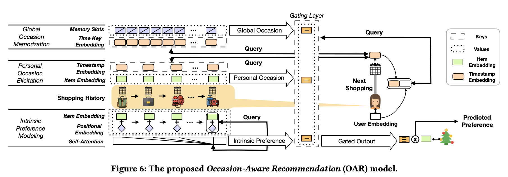

# Occasion Aware Recommendation

> This is the reading summary of paper [*Time to Shop for Valentine’s Day: Shopping Occasions and Sequential Recommendation in E-commerce*](http://people.tamu.edu/~jwang713/pubs/occasion-wsdm2020.pdf).
>
> You can find the corresponding code on Github [Occasion-Aware-Recommenation](https://github.com/wangjlgz/Occasion-Aware-Recommenation)

## Overall model

$$
\mathbf{U} = \{ u_1, u_2, ..., u_n\} \\ 
\mathbf{P} = \{ p_1, p_2, ..., p_C\} \\
\mathbf{T} = \{ t_1, t_2, ..., t_M\} \\

\mathbf{H^{u_1}} = \{(p_1^{u_1}, t_1^{u_1}), (p_2^{u_1}, t_2^{u_1}),...(p_{|H^{u_1}|}^{u_1}, t_{|H^{u_1}|}^{u_1})\}
$$

$$
\text{query } \mathbf{q} \text{ and key-value pairs } \mathbf{P} = \{(K_l, v_l)|l \in [1,L]\} \\
\text{output:} o = \sum_{l=1}^{l}{\alpha_{ql} v_l}, \text{where } \alpha_{ql} = \frac{exp(s(q,k_l))}{\sum_{l=1}^{L}{exp(s(q,k_l))}}
$$

## Intrinsic preference modeling

* For user u, stack his/her items into a single array in time order
  $$
  \mathbf{P^u} = (p_1^u, p_2^u, ..., p_{|P^u|}^u)\\
  $$

* each item has itself's embedding and its position embedding, item bought at the same time should have sam position embedding