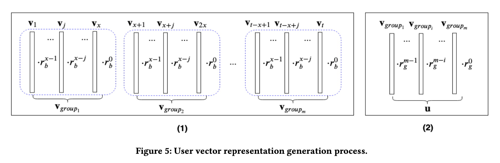

## TIFUKNN 

> Two patterns in PIF (personalized item frequency): 
> $$
> user_i'\ s \ record \ \ \{ v_1, v_2, ..., v_i, ..., v_t\}, \ where \ v_i = [0,1,1,1,1,0....]^T, \ predict \ v_{t+1}
> $$
>
> * item frequency - repeated purchase pattern
>
>   * next basket contains user's historical records
>   * has been used, get considerable performance gain
>
> * similar user - colllaborative purchase pattern
>
>   * use vector to represent each user, top 300 nearest neighbors
>
>   * $$
>     PIF_{vector} = \sum_{i=1}^{t}{v_i}
>     $$
>
>   * caculate 4 ratios
>
>     * captured by repeated: 0.1 - 0.6
>     * Captured by collaborative - most, 0.5 - 0.98
>     * captured by both: 0.1 - 0.6 around but smaller than repeated since intersection
>     * Not captured by both: 0.01-0.4, most 0.1:  1- union of repeated and collaborative
>
>   * RNNs has difficulty to learn vector addition

#### code return

```bash
$ python TIFUKNN.py ./data/TaFang_history_NB.csv ./data/TaFang_future_NB.csv 300 0.9 0.7 0.7 7 10           
start dictionary generation...
{'MATERIAL_NUMBER': 11997}
# dimensions of final vector: 11997 | 0
finish dictionary generation*****
Number of training instances: 10000
Num. of top:  10
recall:  0.12933969065750625
NDCG:  0.09859257577070348
```


## temporal-item-frequency-baseduser-KNN (TIFUKNN)

> Existing methods:
>
> * Markov chain: cannot capture high-order information from long time ago
> * KNN can capture unseen pattern but it is only a small part in the target baske
>   * item embedding
>   * model temperal relation across all the baskets - user representation

#### Integrating Temporal Dynamics

> item with same frequency cannot be discriminated

> gap distibution - decay weight: early item appears, smaller weight to the final frequency


#### Nearest Neighbors based method

* similarity calculation
* prediction based on similarity

##### User similarity calculation

* Sum up; hierarchical time decayed weights 

* Steps
  $$
  \{ v_1, v_2, ..., v_i, ..., v_t\}, \ where \ v_i = [0,1,1,1,1,0....]^T
  $$

  * partition historical 20 baskets into 5 groups
    $$
    Group_j = [v_1, v_2, ..., v_{x = \frac{t}{m}} ]
    $$

    * if cannot equally partitioned, each full basket take ceiling t/m and the first group can be less

  * Within group: each vector j in each group multiply a time-decayed weight r_b^{x-j}
    $$
    v_{group} = v_1 \times  r_b^{x-1} + v_2 \times r_b^{x-2} + ... + v_{x} \times r_b^0
    $$

  * Cross group: each group vector multiply a weight
    $$
    v_{user} = v_{g_1} \times  r_g^{m-1} + v_{g_2} \times r_g^{x-2} + ... + v_{g_x} \times r_g^0
    $$

  * Now get the user representation and use for similarity calculation - Euclidean distance or other

  * Final predict, hyperparameter \alpha
    $$
    P = \alpha \times v_{user} + (1-\alpha) \times u_{nearest\ neighber}
    $$

* 



## Drawbacks

* If customer A only buys bananas again and agian and no other items. It can be the nearest neighbors to anyone else.
* A's bananas will have super high score and be in the final top_k for anyone else.
